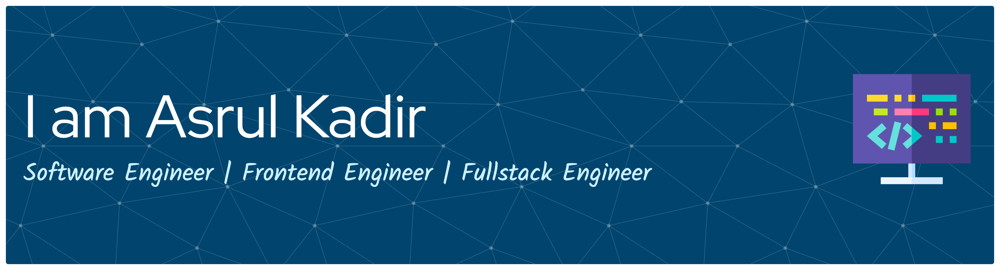

# Hi there 👋

## 🚀 About Me

I'm a passionate **Software Engineer** specializing in modern web technologies. I love building scalable applications and solving complex problems with clean, efficient code. Currently focused on creating amazing user experiences with **React.js** and robust backend systems with **Node.js** and **NestJS**.

- 🔭 I'm currently working on **Full Stack Web Applications**
- 🌱 I'm currently learning **Advanced System Design** and **Cloud Architecture**
- 👯 I'm looking to collaborate on **Open Source Projects**
- 💬 Ask me about **React.js, Node.js, NestJS, MongoDB, JavaScript/TypeScript**
- ⚡ Fun fact: I believe great software is a combination of art and science

## 🛠️ Tech Stack

### Frontend

  
  
  
  
  
  
  

### Backend

  
  
  

### Database & Cloud

  
  
  

### Tools & Others

  
  
  
  
  
  

## 🎮 GitHub Stats

  

  

  

## 🎯 Current Focus

- 🔥 Building scalable web applications with **React.js** and **Node.js**
- 📚 Exploring **Microservices Architecture** with **NestJS**
- 🚀 Learning **DevOps** practices and **Cloud Technologies**
- 🎨 Creating beautiful UIs with modern **CSS frameworks**

## 📫 Let's Connect!

  
  
  
  

---

  

  <i>⭐️ From <a href="https://github.com/asrulkadir">asrulkadir</a></i>

<picture>
  <source media="(prefers-color-scheme: dark)" srcset="https://raw.githubusercontent.com/asrulkadir/asrulkadir/output/pacman-contribution-graph-dark.svg">
  <source media="(prefers-color-scheme: light)" srcset="https://raw.githubusercontent.com/asrulkadir/asrulkadir/output/pacman-contribution-graph.svg">
  
</picture>